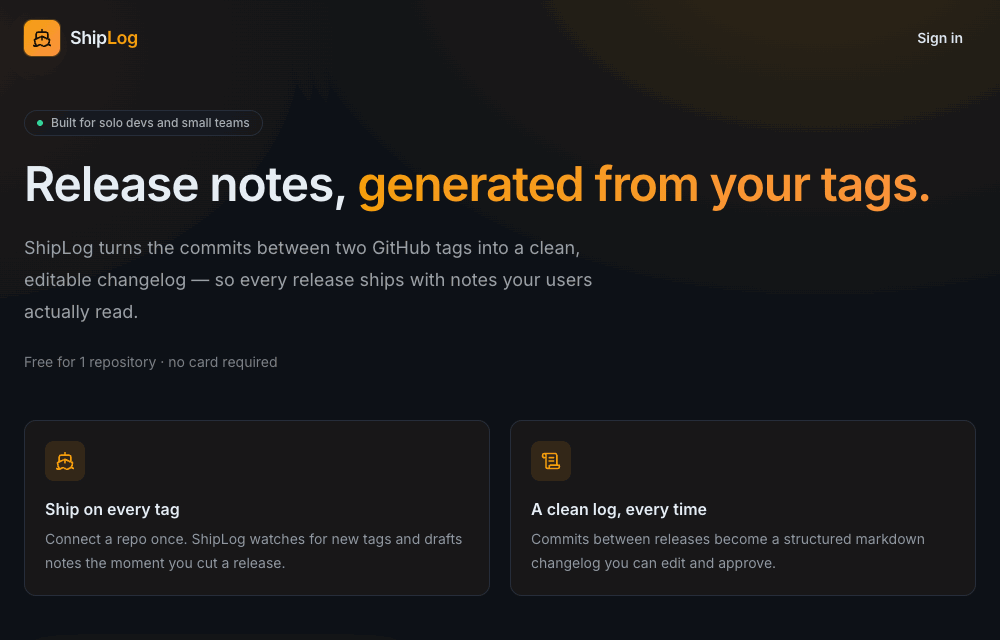

# ShipLog

Automated GitHub release notes.

Live app: https://shplog.dev

## GitHub App Description

ShipLog turns GitHub tags and commits into clean, editable release notes.

GitHub App: https://github.com/apps/shplog-dev

## Podcast vs Reality

This repository contains the public build log of a 90-day experiment.

Question:

Can a solo developer build and market a nano SaaS using modern AI tools?

The product is ShipLog, a GitHub App that generates release notes.

All metrics, predictions, successes and failures will be published publicly.

## Experiment Status

Public launch starts on 2026-06-14.

Tier 0 marketing runs from 2026-06-14 to 2026-06-20. During this phase, ShipLog is public and usable, but not actively promoted.

## Repository Structure

`docs/` contains project documents such as the experiment charter, predictions and marketing notes.

`logs/` contains weekly progress updates for the 90-day experiment.

`app/` contains the SvelteKit frontend application.
